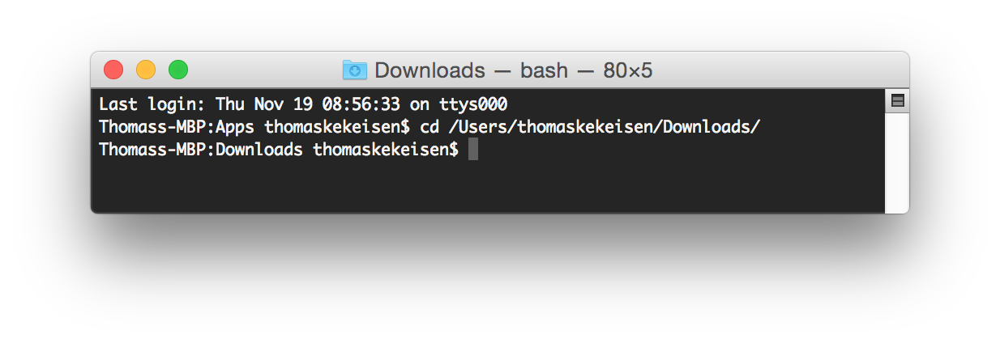
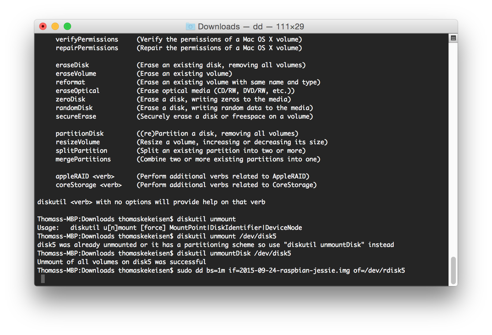
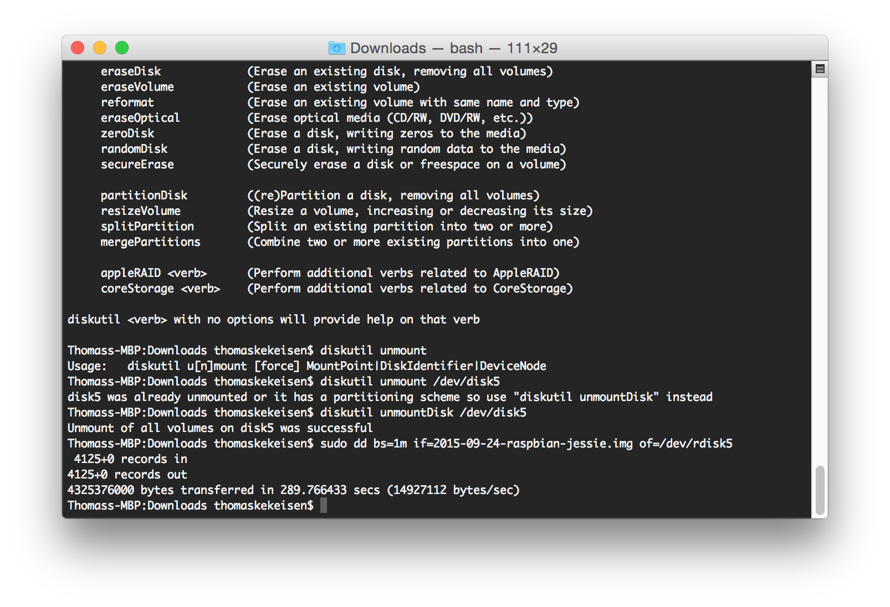

# PiSleepTalk

---

TODO: Project description

## Short description (for professionals)

* Download Raspbian or another operating system you like
* Install the image on your sd card (See [https://www.raspberrypi.org/documentation/installation/installing-images/](https://www.raspberrypi.org/documentation/installation/installing-images/))

## Long descriptions (step by step)

TODO: explain the explaination

## Download the image

Go to [http://www.raspberrypi.org/downloads/](http://www.raspberrypi.org/downloads/) and download the latest version of **Raspbian**. You should download a file called `2015-09-24-raspbian-jessie.zip`. Unzip this file to get a `img` file. In the most cases this file is also called `2015-09-24-raspbian-jessie.img`.

## Make the sd card ready

To install the image on your sd card you can follow the description [here](https://www.raspberrypi.org/documentation/installation/installing-images/). This readme will it explain, too.

### OSX

* Open your terminal
* Type `diskutil list` to get a list of all disks available on your mac
  
* Remember the number of the disk that matches your sd card, in my case this is `/dev/disk5`
* Type `diskutil unmountDisk <disk path>` to unmount your disk, so in my case it would be: `diskutil unmountDisk /dev/disk5`
* Go to the folder that contains your `img` file
  
* Type the following command, but make sure you replace `n` with your disk number, also you have to replace the path to the image: `sudo dd bs=1m if=path_of_your_image.img of=/dev/rdiskn`, so im my case that would be: `sudo dd bs=1m if=2015-09-24-raspbian-jessie.img of=/dev/rdisk5`
* Grab a coffee (9:04)

 <- TODO: bild fixen
 <- TODO: bild fixen
 <- TODO: bild fixen

dont forget to expand your file system

https://outflux.net/blog/archives/2009/04/19/recording-from-pulseaudio/

sudo mkdir /usr/sleeptalk

sudo apt-get install pulseaudio

list sources: pacmd list-sources | grep -e device.string -e 'name:'

alsa_input.usb-C-Media_Electronics_Inc._USB_PnP_Sound_Device-00-Device.analog-mono

load-module module-oss device=/dev/dsp sink_name=alsa_output.pci-0000_04_01.0.analog-stereo mmap=1

MONITOR=$(pactl list | egrep -A2 '^(\*\*\* )?Source #' | grep 'Name: .*\.monitor$' | awk '{print $NF}' | tail -n1)

echo "set-source-mute ${MONITOR} false" | pacmd >/dev/null

http://raspberrywebserver.com/serveradmin/run-a-script-on-start-up.html

if (true)
{
   echo “jonas”
}
else
{
   echo “thomas”
}

http://thomer.com/howtos/sound-detect

sudo arecord -D plughw:1 --max-file-time=5 -f cd -vv /usr/sleeptalk/record.wav

http://thomer.com/howtos/detect_sound.html

#!/usr/bin/ruby -w
#
# Copyright (C) 2009 Thomer M. Gil [http://thomer.com/]
#
# Oct  22, 2009: Initial version
#
# This program is free software. You may distribute it under the terms of
# the GNU General Public License as published by the Free Software
# Foundation, version 2.
#
# This program is distributed in the hope that it will be useful, but
# WITHOUT ANY WARRANTY; without even the implied warranty of
# MERCHANTABILITY or FITNESS FOR A PARTICULAR PURPOSE. See the GNU General
# Public License for more details.
#
# This program detects the presence of sound and invokes a program.
#

require 'getoptlong'

# You need to replace MICROPHONE with the name of your microphone, as reported
# by /proc/asound/cards
MICROPHONE = 'QuickCam Pro 9000'
HWDEVICE = `cat /proc/asound/cards | grep '#{MICROPHONE}' | awk '{print $1}'`.to_i
SAMPLE_DURATION = 5 # seconds
FORMAT = 'S16_LE'   # this is the format that my USB microphone generates
THRESHOLD = 0.15

if !File.exists?('/usr/bin/arecord')
warn "/usr/bin/arecord not found; install package alsa-utils"
exit 1
end

if !File.exists?('/usr/bin/sox')
warn "/usr/bin/sox not found; install package sox"
exit 1
end

if !File.exists?('/proc/asound/cards')
warn "/proc/asound/cards not found"
exit 1
end

$options = {}
opts = GetoptLong.new(*[
[ "--verbose", "-v", GetoptLong::NO_ARGUMENT ],
])
opts.each { |opt, arg| $options[opt] = arg }

loop do
out = `/usr/bin/arecord -D plughw:#{HWDEVICE},0 -d #{SAMPLE_DURATION} -f #{FORMAT} 2>/dev/null | /usr/bin/sox -t .wav - -n stat 2>&1`
out.match(/Maximum amplitude:\s+(.*)/m)
amplitude = $1.to_f
puts amplitude if $options['--verbose']
if amplitude > THRESHOLD
# You need to replace this with the program you wish to run
# system "echo 'detected sound!'"
else
puts "no sound"
end
end

echo (true ? “jonas” : “thomas”)

wlan

sudo iwlist wlan0 scan

samba

$ sudo apt-get install samba samba-common-bin

sox 

sudo apt-get install sox 

#
# Please remove the "Author" lines above and replace them
# with your own name if you copy and modify this script.

DESC="Crazy sleep talk recorder"
DAEMON=/usr/sbin/sleeptalkrec

case "$1" in
    start)
        arecord -D plughw:1 --max-file-time=5 -f cd -vv /usr/sleeptalk/record.wav
        ;;
    stop)
        # STOP
        ;;
    restart)
        # RESTART
        ;;
esac
 
exit 0

todo: register service

pi@raspberrypi /etc/init.d $ sudo nano sleeptalkrec

sudo apt-get install sox 

